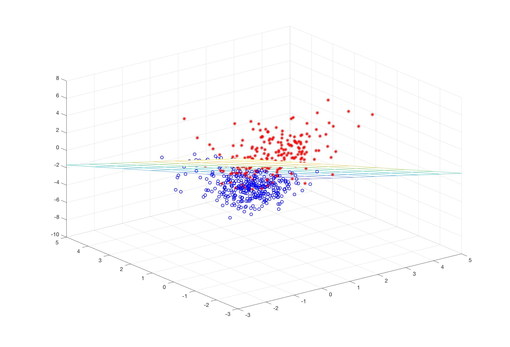

# README

The implementation of the logistic regression and SMOTE model using MATLAB.

>The dataset used is in the UCI Machine Learning Repository, which is downloaded from  http://archive.ics.uci.edu/ml/machine-learning-databases/breast-cancer-wisconsin/wdbc.data.

### Dependence

---

* MATLAB R2017b

### Run Demo

---

* Ensure that the dataset file  `wdbc.data`	and `main.m` is under the same folder.
* **Run the `main.m` script** and you will see the training process and testing results.

```Cmd
[0/100]:	loss: 221.8517   train accuracy: 0.8970   test accuracy: 0.8304
[10/100]:	loss: 59.2625   train accuracy: 0.9601   test accuracy: 0.9286
[20/100]:	loss: 44.8149   train accuracy: 0.9751   test accuracy: 0.9554
[30/100]:	loss: 41.1090   train accuracy: 0.9767   test accuracy: 0.9554
[40/100]:	loss: 38.9043   train accuracy: 0.9817   test accuracy: 0.9554
[50/100]:	loss: 37.2866   train accuracy: 0.9834   test accuracy: 0.9554
[60/100]:	loss: 35.9929   train accuracy: 0.9850   test accuracy: 0.9554
[70/100]:	loss: 34.9111   train accuracy: 0.9850   test accuracy: 0.9643
[80/100]:	loss: 33.9818   train accuracy: 0.9850   test accuracy: 0.9643
[90/100]:	loss: 33.1689   train accuracy: 0.9850   test accuracy: 0.9732
[100/100]:	loss: 32.4484   train accuracy: 0.9850   test accuracy: 0.9732
Precision: 1.0000   Recall: 0.9464   F measure: 0.9677(beta=1.2)
```

* For easy observation, visualization is performed on the first three attributes.



### Parameters Settings

---

#### The division of training set and test set

* Choose **10% positive samples and 10% negative samples** as test set. You can change this proportion in line 17 of `main.m`.
*  The rest of the dataset is used as training set. SMOTE is used to solve class imbalance problems. 

#### Gradient descent

* **Learning rate is set to 0.001**. You can change this value in line 42 of `main.m`.
* **The number of iterations is set to 100**. You can change. You can change this value in line 43 of `main.m`.

#### Performance metric

* **The beta value of F-measure is set to 1.2**, this is because for disease diagnosis problem in this dataset, the recall rate is more important. You can change this value in line 63 of `main.m`.
